# Paul Danso Baffoe, Chartered Economist, M.S., CBE

<div align="center">

## Applied Economist • Econometrician • Economic Research Analyst • Data Scientist

Applied Econometrics • Labor Economics • Macroeconomics • Monetary Economics • Causal Inference • Forecasting • Policy Evaluation • Supply Chain Economics

[](https://pbaffoe88.github.io/Portfolio/)
[](https://www.linkedin.com/in/paul-baffoe)
[](https://github.com/PBaffoe88)
[](https://rpubs.com/PaulBaffoe)

[](assets/Economics%20Analyst%20Specialist%20Resume.pdf)

</div>

---

# Research Portfolio

Welcome to my professional research portfolio.

I am an Applied Economist whose research combines modern econometric methods, reproducible programming, and large public datasets to evaluate economic policy and answer applied research questions. My work spans labor economics, monetary economics, macroeconomics, supply-chain analytics, and energy markets, with an emphasis on causal inference and evidence-based decision-making.

This repository contains:

- 📄 Working papers
- 📊 Publication-quality figures
- 📈 Reproducible R workflows
- 📂 Open-data pipelines
- 📚 Econometric research
- 💼 Industry analytics projects
- 📑 Professional résumé

---

## Portfolio Website

### 🌐 https://pbaffoe88.github.io/Portfolio/

The portfolio website includes:

- Interactive research portfolio
- Working papers
- Research visualizations
- Downloadable résumé
- GitHub repositories
- Publications
- Contact information

---
# About Me

I am an **Applied Economist** with expertise in econometrics, causal inference, labor economics, macroeconomics, forecasting, and quantitative policy analysis. My work combines rigorous empirical methods with modern programming tools to transform complex economic data into evidence that informs public policy, business strategy, and operational decision-making.

I have experience conducting applied research across academia, manufacturing, official statistics, and private industry. My projects integrate large administrative, survey, and macroeconomic datasets to evaluate labor markets, monetary policy, fiscal policy, supply chains, and energy markets using reproducible analytical workflows.

My approach emphasizes three principles:

- **Scientific rigor** through transparent econometric methods and robustness checks.
- **Reproducibility** using open-source programming and documented analytical pipelines.
- **Practical relevance** by translating complex empirical findings into actionable recommendations for policymakers, businesses, and researchers.

---

# Research Interests

My current research agenda focuses on the intersection of applied econometrics, public policy, and macroeconomic analysis.

## Primary Research Areas

- Applied Econometrics
- Labor Economics
- Childcare Economics
- Public Policy Evaluation
- Macroeconomics
- Monetary Economics
- Fiscal Policy
- International Economics
- Economic Forecasting
- Time-Series Econometrics
- Causal Inference
- Supply Chain Economics
- Inventory Analytics
- Energy Economics
- Commodity Markets
- Machine Learning for Economics
- Reproducible Research

---

# Research Philosophy

My research is motivated by practical policy questions that can be answered through careful empirical analysis.

Rather than relying on theoretical arguments alone, I focus on integrating high-quality public datasets with modern econometric techniques to identify economically meaningful relationships. Every project is designed to be transparent, reproducible, and extensible, allowing other researchers to replicate results and build upon the analysis.

My goal is to produce research that is academically rigorous while remaining useful to policymakers, central banks, government agencies, and industry practitioners.

---

# Research Expertise

## Applied Econometrics

- Panel Data Models
- Difference-in-Differences (DiD)
- Two-Way Fixed Effects (TWFE)
- HonestDiD
- Instrumental Variables (IV)
- Two-Stage Least Squares (2SLS)
- Regression Discontinuity Design (RDD)
- Event Study Analysis

## Time-Series Econometrics

- Structural VAR (SVAR)
- Vector Error Correction Models (VECM)
- ARDL Models
- Cointegration Analysis
- Local Projections (Jordà)
- Markov-Switching Models
- EGARCH
- Forecast Error Variance Decomposition (FEVD)
- Impulse Response Functions (IRFs)

## Forecasting & Analytics

- Economic Forecasting
- Demand Forecasting
- Inventory Forecasting
- Time-Series Modeling
- Business Intelligence
- Predictive Analytics
- Scenario Analysis

---

# Research Workflow

Every project in this portfolio follows a standardized empirical workflow.

```text
Research Question
        │
        ▼
Literature Review
        │
        ▼
Public Data Collection
        │
        ▼
Data Cleaning & Validation
        │
        ▼
Exploratory Data Analysis
        │
        ▼
Econometric Model Development
        │
        ▼
Model Diagnostics
        │
        ▼
Robustness Checks
        │
        ▼
Publication-Quality Figures
        │
        ▼
Working Paper
        │
        ▼
Open-Source Repository
```

This workflow ensures that every result presented in this portfolio is transparent, reproducible, and supported by documented analytical code.

---

# Public Data Sources

My research routinely integrates data from national and international statistical agencies, including:

### United States

- Federal Reserve Economic Data (FRED)
- Bureau of Labor Statistics (BLS)
- Bureau of Economic Analysis (BEA)
- U.S. Census Bureau
- American Community Survey (ACS PUMS)
- Quarterly Census of Employment and Wages (QCEW)
- Census M3 Manufacturing Survey

### State of Minnesota

- Minnesota Department of Human Services (DHS/DCYF)
- Minnesota Department of Employment and Economic Development (DEED)

### International

- OECD Statistics
- World Bank Open Data
- National Accounts
- Caldara–Iacoviello Geopolitical Risk Index

---
# Working Papers & Featured Research

My research combines modern econometric methods, reproducible programming, and large public datasets to answer policy-relevant questions in labor economics, macroeconomics, monetary economics, and energy markets.

Every project includes documented methodology, publication-quality figures, reproducible code, and transparent analytical workflows.

---

# 🏠 The Childcare Constraint

### *Estimating the Causal Effect of Childcare Access on Labor Supply in Central Minnesota*

**Status:** 🟢 Working Paper — Preparing for Journal Submission

---

## Research Question

> Does access to licensed childcare increase labor-force participation, employment, and full-time employment among parents with young children?

---

## Why This Research Matters

Childcare affordability and availability remain among the largest barriers preventing parents from participating fully in the labor market.

While many studies focus on childcare costs, relatively little evidence exists on whether **expanding childcare supply itself causally affects employment outcomes**, particularly at the local level.

This project develops a comprehensive empirical framework integrating administrative licensing records with household microdata to estimate these relationships.

---

## Main Findings

✔ Significant heterogeneity across household types

- Single mothers exhibit a significant negative labor-force participation response in higher childcare-supply areas (β ≈ −0.14).

- Single fathers exhibit a significant positive employment response (β ≈ +0.14).

✔ Regression discontinuity evidence

- Full-time employment declines sharply at the CCAP eligibility threshold.

- Estimated Local Average Treatment Effect

```
β ≈ −0.30
p = 0.001
```

✔ Placebo thresholds show no comparable discontinuity.

✔ Results suggest that **how childcare assistance phases out may matter as much as overall childcare availability.**

---

## Data

- Minnesota DHS / DCYF Childcare Licensing Records (20 years)
- ACS PUMS Microdata (N ≈ 103,000)
- Minnesota DEED
- Quarterly Census of Employment and Wages (QCEW)
- Federal Reserve Economic Data (FRED)

---

## Econometric Methods

- Difference-in-Differences (DiD)
- Two-Way Fixed Effects
- HonestDiD
- Instrumental Variables
- Regression Discontinuity Design
- Cluster-Robust Standard Errors

---

## Software

- R
- fixest
- rdrobust
- ivreg
- did
- ggplot2
- modelsummary

---

## Research Figures

### Childcare Supply Expansion and Labor Supply

<p align="center">
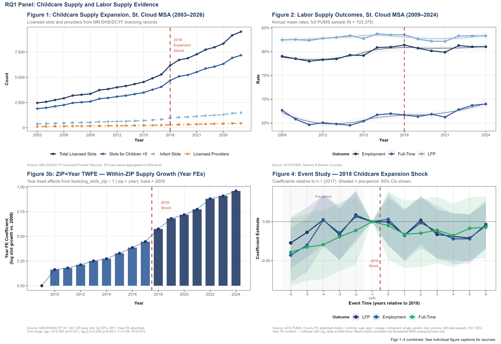
</p>

*Expansion of childcare supply, labor-force participation, within-ZIP growth, and event-study evidence around the 2018 expansion.*

---

### Heterogeneous Effects Across Household Types

<p align="center">
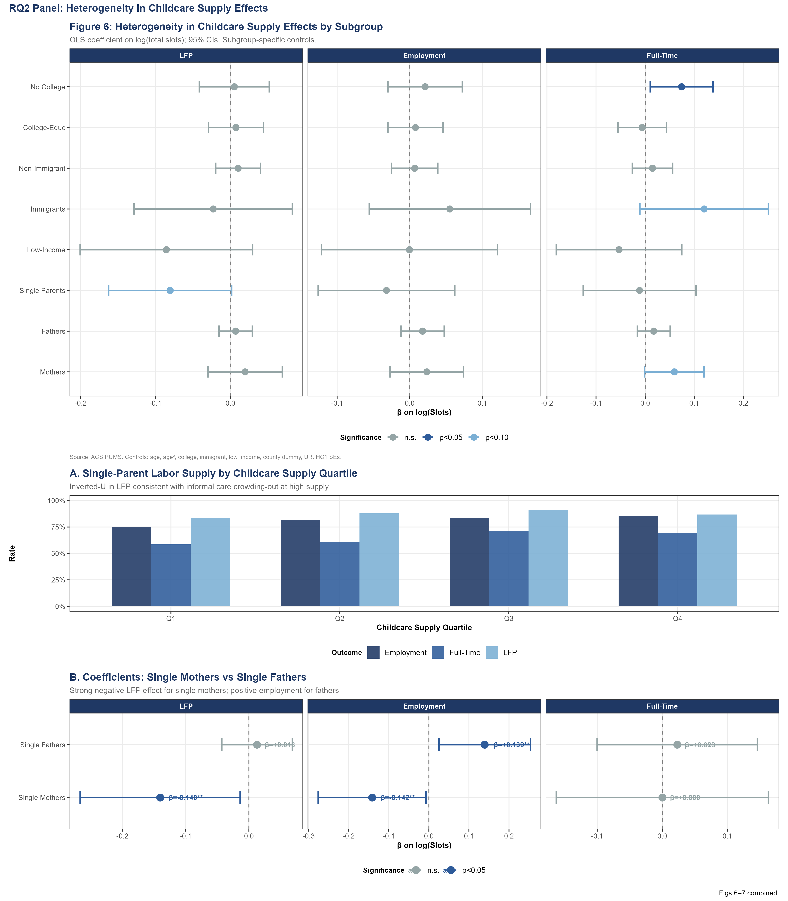
</p>

*Single mothers and single fathers respond very differently to childcare supply expansion.*

---

### Regression Discontinuity

<p align="center">
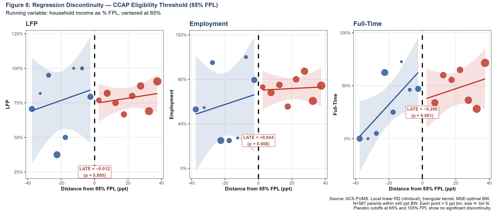
</p>

*Regression discontinuity estimates at the CCAP eligibility threshold.*

---

### Repository

🔗 **Code:** *(Repository coming soon)*

🔗 **Working Paper:** *(PDF coming soon)*

---

# 🏭 Buffer Depletion and Price Instability

### *The Inventory Channel of Monetary Policy in U.S. Manufacturing*

**Status:** 🟢 Working Paper

---

## Research Question

> Do contractionary monetary-policy shocks affect inventory behavior and producer-price volatility?

---

## Why This Research Matters

Inventories represent one of the least understood channels through which monetary policy influences manufacturing activity.

This research evaluates whether higher interest rates create temporary inventory accumulation, amplify producer-price volatility, and alter manufacturing adjustment dynamics.

---

## Main Findings

✔ Inventory-intensive sectors experience persistent increases in inventory-to-shipments ratios after contractionary monetary shocks.

✔ Inventory accumulation peaks around

```
+0.40
```

and remains elevated for approximately

```
18 months.
```

✔ Producer-price volatility increases significantly.

✔ Twelve-month placebo shocks show no comparable responses.

✔ Sector inventory intensity materially changes the response to monetary tightening.

---

## Data

- Census M3 Manufacturing Survey
- BLS Producer Price Index
- Federal Reserve Economic Data
- San Francisco Fed Monetary Policy Surprises

---

## Methods

- Jordà Local Projections
- Two-Way Fixed Effects
- Split-Sample Analysis
- Placebo Tests

---

## Research Figures

### Inventory Channel

<p align="center">
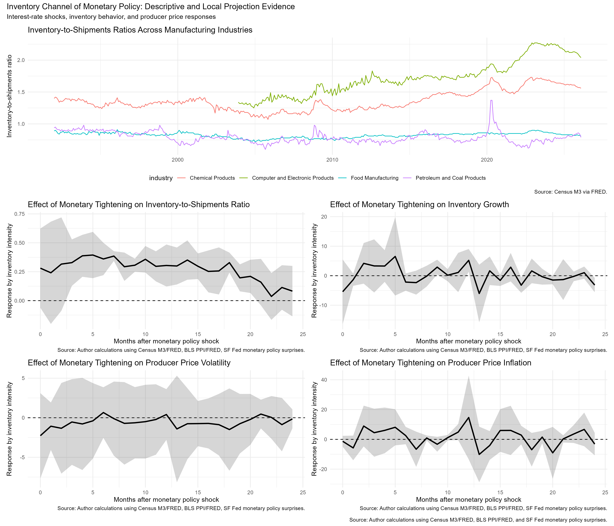
</p>

---

### Manufacturing Expectations

<p align="center">
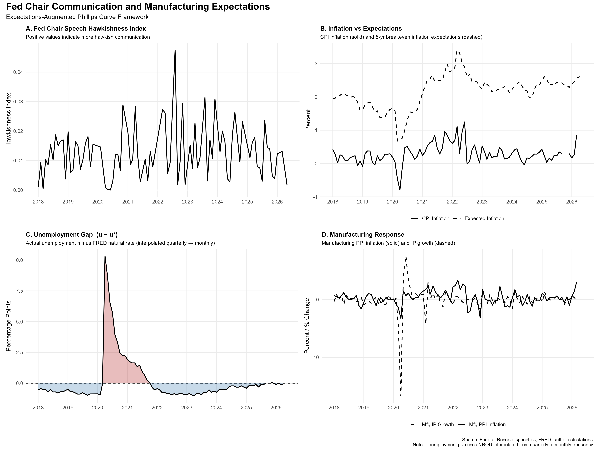
</p>

---

### Placebo Test

<p align="center">
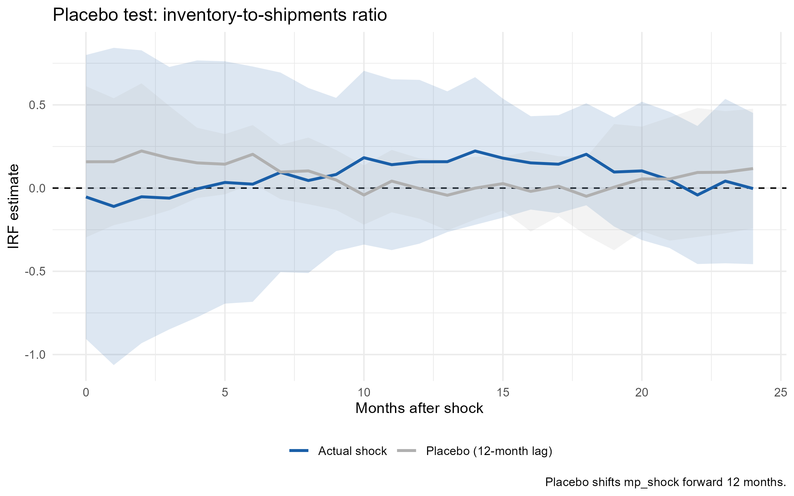
</p>

---

### Producer Price Volatility

<p align="center">
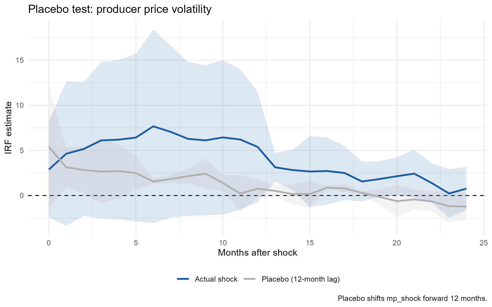
</p>

---

### Inventory Intensity

<p align="center">
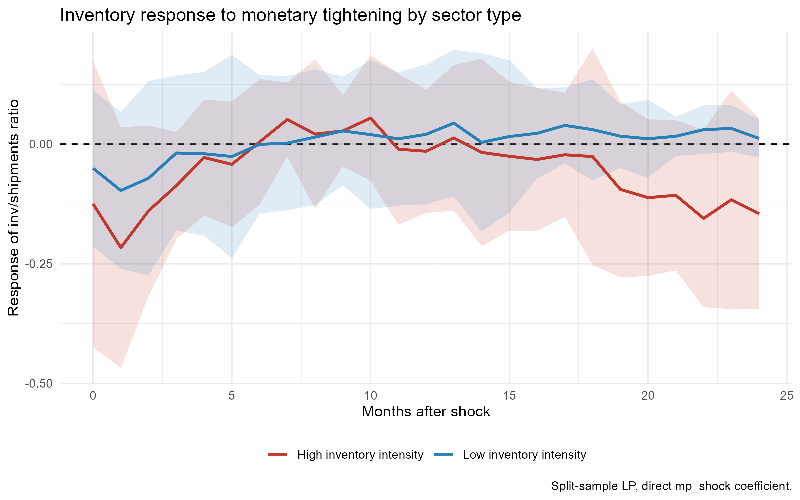
</p>

---

### Repository

🔗 **Code:** *(Repository coming soon)*

---

# 🛢 Oil Prices and Geopolitical Risk

### *What 35 Years of Data Reveal About Oil Markets*

**Status:** 🟢 Working Paper + Published Article

---

## Research Question

> Does geopolitical uncertainty primarily influence oil prices or oil-price volatility?

---

## Main Findings

✔ Two-state Markov-switching model identifies a persistent crisis regime.

✔ Crisis probabilities increase around

- Gulf War
- Global Financial Crisis
- 2014–2016 Oil Collapse
- COVID-19 Pandemic
- 2022 Geopolitical Shock

✔ Local projections indicate geopolitical risk affects volatility much more than long-run oil-price levels.

✔ Momentum behavior differs substantially across one-, three-, six-, and twelve-month horizons.

---

## Methods

- Markov Switching
- EGARCH
- Jordà Local Projections
- Time-Series Momentum

---

## Research Figures

### Geopolitical Risk Shock

<p align="center">
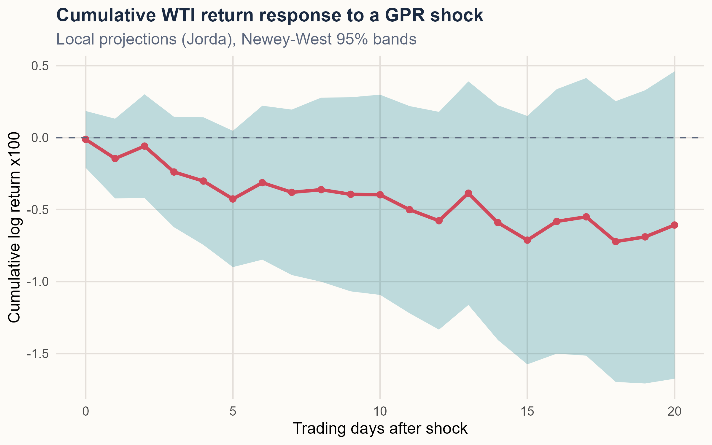
</p>

---

### Crisis Regime Probability

<p align="center">
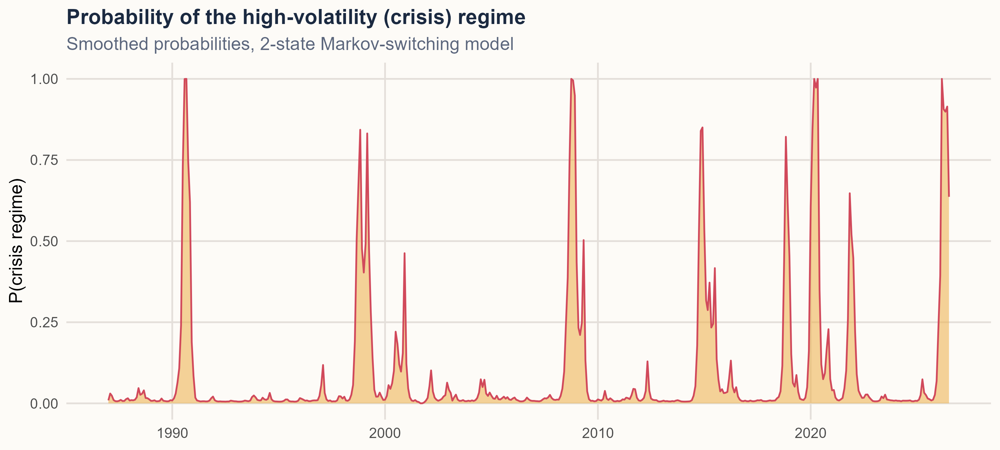
</p>

---

### Oil Momentum

<p align="center">
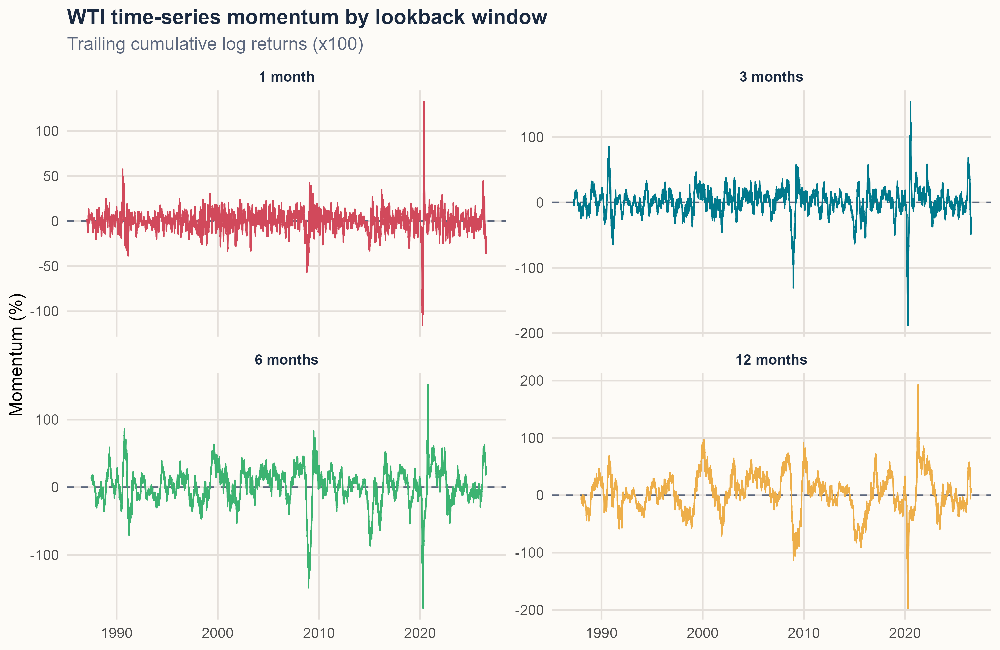
</p>

---

### Trend Regimes

<p align="center">
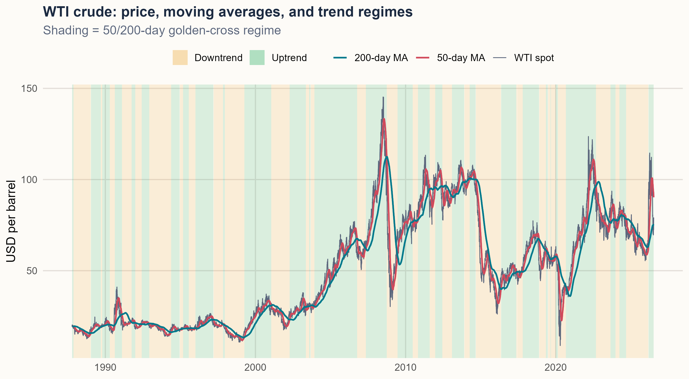
</p>

---

### Repository

🔗 **Code:** *(Repository coming soon)*

🔗 **Published Article:** *(Add LinkedIn or publication link)*

---
# Professional Experience

My professional experience spans applied economic research, official statistics, manufacturing analytics, business intelligence, forecasting, and quantitative decision support. Across academia, government, and industry, I have developed reproducible analytical workflows that transform complex datasets into evidence supporting policy, operational, and strategic decision-making.

---

# Bay State Milling Company

## Quantitative & Economic Data Analyst
**Woodland, California**  
**April 2023 – March 2026**

At Bay State Milling, I applied quantitative methods to improve operational planning, procurement, inventory management, and business intelligence. Working with cross-functional teams, I translated large operational datasets into forecasting tools, dashboards, and decision-support models that enhanced planning accuracy and reduced reporting effort.

### Responsibilities

#### Economic & Statistical Analysis

- Conducted statistical analyses of commodity demand, purchasing behavior, inventory performance, and production trends using large operational datasets.
- Identified operational bottlenecks and emerging trends through descriptive and inferential statistical analysis.
- Produced analytical reports supporting evidence-based business decisions.

#### Forecasting & Inventory Analytics

- Developed quantitative forecasting models using historical production and inventory data.
- Improved planning accuracy by approximately **25%** through statistically driven forecasting models.
- Designed an **Order Cadence Model** integrating demand forecasts, inventory position, pipeline inventory, safety stock, and supplier lead times.
- Applied inventory analytics to support procurement planning and reduce supply-chain risk.

#### Business Intelligence

- Built automated dashboards using **Power BI**, **SQL**, and **Excel**.
- Reduced manual reporting effort by approximately **40%**.
- Created executive dashboards monitoring operational performance, purchasing activity, inventory levels, and production metrics.

#### Data Quality & Validation

- Performed statistical quality assurance on high-volume operational datasets.
- Validated production, purchasing, and inventory records.
- Investigated anomalies and improved analytical reliability through standardized validation procedures.

#### Stakeholder Communication

- Presented analytical findings to procurement, operations, finance, quality assurance, and executive leadership.
- Translated statistical analyses into actionable operational recommendations.

### Technologies

**Programming**

- SQL
- Excel
- Power BI

**Methods**

- Forecasting
- Inventory Analytics
- Statistical Analysis
- Business Intelligence
- Dashboard Development
- Data Validation

---

# St. Cloud State University

## Graduate Economics Research Assistant
**Department of Economics**  
**August 2021 – April 2023**

As a Graduate Economics Research Assistant, I conducted empirical research in labor economics, macroeconomics, monetary economics, and public policy. My work involved developing econometric models, integrating large public datasets, conducting literature reviews, and producing reproducible analytical workflows supporting faculty-led research.

### Responsibilities

#### Applied Economic Research

- Designed empirical studies addressing labor-market, macroeconomic, and public-policy questions.
- Conducted quantitative policy evaluation using modern econometric methods.
- Investigated fiscal policy, monetary policy, inflation, labor markets, and international macroeconomic relationships.

#### Econometric Modeling

Developed empirical models using

- Structural VAR (SVAR)
- Autoregressive Distributed Lag (ARDL)
- Panel Data Models
- Time-Series Forecasting
- Regression Analysis

#### Public Data Integration

Retrieved and processed data from

- Federal Reserve Economic Data (FRED)
- Bureau of Labor Statistics (BLS)
- Bureau of Economic Analysis (BEA)
- OECD Statistics
- World Bank Open Data
- ACS PUMS

Responsibilities included

- API retrieval
- Data cleaning
- Data transformation
- Variable construction
- Panel-data assembly
- Data validation

#### Reproducible Research

Developed reproducible analytical workflows in **R** including

- Automated data cleaning
- Statistical modeling
- Publication-quality figures
- Research documentation
- Reproducible reports
- Version-controlled code

#### Literature Reviews

- Conducted systematic reviews of economic literature.
- Evaluated econometric methodologies.
- Identified research gaps.
- Synthesized empirical evidence supporting hypothesis development.

#### Research Communication

Presented findings through

- Faculty meetings
- Graduate seminars
- Technical reports
- Academic presentations
- Policy discussions

### Technologies

**Programming**

- R
- Stata
- SQL
- SAS

**Methods**

- Econometrics
- Time-Series Analysis
- Forecasting
- Regression Analysis
- SVAR
- ARDL
- Causal Inference

---

# Ghana Statistical Service

## District Data Quality Monitor
**National Population and Housing Census**  
**February 2021 – August 2021**

Supported Ghana's national census by ensuring the statistical quality, completeness, and consistency of demographic and socioeconomic data collected across multiple enumeration areas.

### Responsibilities

- Monitored census operations across **32 communities**.
- Performed statistical quality assurance and consistency checks.
- Validated demographic, labor-market, and household survey data.
- Used **Stata**, **Excel**, and **CSPro** to perform statistical summaries and data validation.
- Collaborated with field supervisors to resolve reporting discrepancies.
- Prepared statistical reports supporting national census operations.

### Methods

- Survey Statistics
- Data Validation
- Descriptive Statistics
- Official Statistics
- Quality Assurance

---

# Caldera Equity Group LLC

## Market Data & Pricing Analyst (Co-Founder)
**February 2026 – Present**

Support strategic decision-making through market intelligence, pricing analysis, financial modeling, and business analytics.

### Responsibilities

- Conduct market and pricing analysis using operational and transaction datasets.
- Develop valuation models supporting investment decisions.
- Build interactive dashboards using Excel and Power BI.
- Analyze pricing trends, comparable transactions, and market performance.
- Prepare analytical reports supporting business strategy.

### Methods

- Market Research
- Pricing Analytics
- Financial Modeling
- Business Intelligence
- Dashboard Development

---

# Selected Professional Achievements

Throughout my career I have consistently applied quantitative methods to solve practical economic and business problems.

### Applied Economics

- Developed reproducible empirical research using modern econometric techniques.
- Built forecasting models supporting operational and policy decisions.
- Applied causal inference methods to evaluate labor-market and macroeconomic outcomes.

### Data Science & Analytics

- Automated analytical workflows using **R**, **SQL**, **Python**, and **Power BI**.
- Built executive dashboards reducing manual reporting while improving visibility into key performance indicators.
- Integrated multiple public and private datasets into unified analytical frameworks.

### Communication

- Presented analytical findings to academic researchers, business leaders, and cross-functional teams.
- Produced technical reports, policy summaries, and publication-quality research outputs.
- Translated complex econometric analyses into actionable recommendations for decision-makers.

---
# Technical Expertise

My research combines modern econometric methods, statistical programming, and reproducible analytical workflows to support evidence-based policy evaluation, economic forecasting, and quantitative decision-making.

---

# Programming Languages

| Language | Experience | Primary Applications |
|-----------|------------|----------------------|
| **R** | Advanced | Econometrics, forecasting, reproducible research, statistical computing |
| **Python** | Advanced | Machine learning, automation, natural language processing |
| **SQL** | Advanced | Database querying, ETL pipelines, relational databases |
| **Stata** | Advanced | Applied econometrics, panel data, policy evaluation |
| **SAS** | Intermediate | Statistical modeling and reporting |
| **Excel (Advanced)** | Advanced | Financial modeling, dashboards, forecasting, Power Query |

---

# Econometric & Statistical Methods

## Cross-Sectional Analysis

- Ordinary Least Squares (OLS)
- Weighted Least Squares (WLS)
- Logistic Regression
- Probit Models

---

## Panel Data Econometrics

- Fixed Effects Models
- Random Effects Models
- Difference-in-Differences (DiD)
- Two-Way Fixed Effects (TWFE)
- Dynamic Panel Models
- Cluster-Robust Standard Errors

---

## Causal Inference

- Instrumental Variables (IV)
- Two-Stage Least Squares (2SLS)
- Regression Discontinuity Design (RDD)
- Event Study Analysis
- HonestDiD
- Robustness & Sensitivity Analysis

---

## Time-Series Econometrics

- ARIMA
- SARIMA
- Exponential Smoothing
- Structural VAR (SVAR)
- VAR
- VECM
- ARDL
- Cointegration
- Error Correction Models
- Local Projections (Jordà)
- Markov-Switching Models
- EGARCH
- Structural Break Analysis

---

## Forecasting

- Macroeconomic Forecasting
- Demand Forecasting
- Inventory Forecasting
- Inflation Forecasting
- Time-Series Forecasting
- Forecast Combination
- Forecast Evaluation
- Scenario Analysis

---

## Statistical Inference

- Wald Tests
- Likelihood Ratio Tests
- ADF Unit Root Tests
- Johansen Cointegration Tests
- Granger Causality
- Bootstrap Methods
- Monte Carlo Simulation

---

# Machine Learning & Artificial Intelligence

My work increasingly incorporates machine learning methods to complement traditional econometric approaches.

### Supervised Learning

- Random Forest
- Gradient Boosting
- Decision Trees
- Support Vector Machines (SVM)
- Regularized Regression (LASSO & Ridge)

### Natural Language Processing

- BERT
- LSTM
- Sentiment Analysis
- Text Classification
- Topic Modeling

### Predictive Analytics

- Feature Engineering
- Hyperparameter Optimization
- Cross Validation
- Model Evaluation

---

# Data Engineering

I design reproducible data pipelines for economic research.

### Data Collection

- API Integration
- Automated Data Retrieval
- Public Data Portals
- Web Data Acquisition
- Bulk Data Downloads

### Data Management

- ETL Pipelines
- Data Cleaning
- Data Validation
- Missing Data Treatment
- Variable Construction
- Panel Data Assembly

### Version Control

- Git
- GitHub
- GitHub Pages
- Markdown
- Quarto

---

# Data Visualization

I develop publication-quality graphics and executive dashboards for academic research and business decision-making.

### Tools

- ggplot2
- Plotly
- Power BI
- Tableau
- Excel
- Quarto
- R Markdown

---

# Public Data Sources

## United States

- Federal Reserve Economic Data (FRED)
- Bureau of Labor Statistics (BLS)
- Bureau of Economic Analysis (BEA)
- U.S. Census Bureau
- American Community Survey (ACS PUMS)
- Quarterly Census of Employment and Wages (QCEW)
- Census M3 Manufacturing Survey

---

## Minnesota

- Minnesota DHS / DCYF
- Minnesota DEED
- Minnesota Job Vacancy Survey
- Minnesota Labor Market Information

---

## International

- OECD Statistics
- World Bank Open Data
- International Monetary Fund
- Penn World Table
- Caldara–Iacoviello Geopolitical Risk Index

---

# Education

## Master of Science in Applied Economics

**St. Cloud State University**  
Graduated: 2023

### Thesis

**Spillover Effects of U.S. Fiscal Policy on OECD Monetary Policy**

Research combined Structural VAR and ARDL models to estimate how U.S. fiscal-policy shocks influence short-term policy rates across more than thirty OECD economies.

---

## Graduate Certificate in Data Analytics

**St. Cloud State University**

Focused on

- Data Mining
- Data Visualization
- Database Management
- Predictive Analytics

---

## Bachelor of Science

**Mathematics with Economics**

University of Cape Coast

Coursework included

- Econometrics
- Advanced Macroeconomics
- Advanced Microeconomics
- Statistical Methods
- Mathematical Economics

---

# Professional Certifications

- ✅ Certified Business Economist (CBE) Examination Passed
- ✅ Graduate Certificate in Data Analytics
- ✅ Applied Econometrics — National Association for Business Economics (NABE)
- ✅ Machine Learning & Data Science for Economists (NABE)
- ✅ Economic Measurement Seminar (NABE)
- ✅ Lean Six Sigma Green Belt
- ✅ Predictive Customer Analytics
- ✅ Meta-Analysis and Research Methods

---

# Awards & Honors

- Michael D. White Economics Fellowship
- Student–Mentor Collaboration Grant
- National Association for Business Economics (NABE) Scholar
- Certified Business Economist (CBE) Candidate

---

# Professional Memberships

- National Association for Business Economics (NABE)
- American Economic Association (Planned)
- Midwest Economics Association
- GitHub Research Community

---

# Research Impact

My work contributes to several areas of applied economics, including

- Labor-market policy
- Childcare economics
- Monetary-policy transmission
- Fiscal-policy spillovers
- Energy economics
- Supply-chain economics
- Forecasting
- Business analytics

Across my projects I emphasize

- Transparent methodology
- Reproducible programming
- Open public data
- Robust econometric identification
- Publication-quality outputs
- Policy relevance

---

# Open Science Commitment

Whenever licensing permits, each repository includes

- Source code
- Data dictionaries
- Documentation
- Replication instructions
- Publication-quality figures
- Working papers
- Reproducible analytical workflows

The goal is to make every project transparent, verifiable, and useful to researchers, policymakers, and practitioners.
# Publications & Working Papers

My current research focuses on labor economics, macroeconomics, monetary policy, forecasting, and quantitative policy evaluation. The projects below represent ongoing and completed empirical research using modern econometric methods and reproducible analytical workflows.

---

## Working Papers

### 🏠 The Childcare Constraint
**Estimating the Causal Effect of Childcare Access on Labor Supply in Central Minnesota**

**Status:** Preparing for journal submission

**Keywords**

Labor Economics • Childcare Economics • Public Policy • Causal Inference • Difference-in-Differences • Instrumental Variables • Regression Discontinuity

**Repository**

➡️ *Repository coming soon*

---

### 🏭 Buffer Depletion and Price Instability

**The Inventory Channel of Monetary Policy in U.S. Manufacturing**

**Status:** Working Paper

**Keywords**

Monetary Economics • Manufacturing • Local Projections • Inventory Analytics • Producer Prices

**Repository**

➡️ *Repository coming soon*

---

### 🛢 Oil Prices and Geopolitical Risk

**What 35 Years of Data Reveal About Crude Oil Markets**

**Status**

Working Paper + Published LinkedIn Research Article

**Keywords**

Energy Economics • Commodity Markets • Markov Switching • EGARCH • Geopolitical Risk

**Repository**

➡️ *Repository coming soon*

---

## Completed Research

### 🌎 Spillover Effects of U.S. Fiscal Policy on OECD Monetary Policy

**Master of Science Thesis**

St. Cloud State University

Combined Structural VAR and ARDL models to estimate how U.S. fiscal-policy shocks influence monetary-policy decisions across more than thirty OECD economies.

---

### 📦 Order Cadence Model

**Industry Project**

Bay State Milling Company

Developed a quantitative inventory optimization framework integrating forecasting, safety stock, lead-time uncertainty, and procurement planning into one operational decision-support system.

---

# Current Research Agenda

My ongoing research pipeline includes

### Labor Economics

- Childcare accessibility
- Labor-force participation
- Employment dynamics
- Family policy

---

### Monetary Economics

- Inventory channel of monetary policy
- Manufacturing adjustment
- Producer-price dynamics
- Inflation transmission

---

### Macroeconomics

- Fiscal-policy spillovers
- International monetary transmission
- OECD policy coordination

---

### Energy Economics

- Geopolitical uncertainty
- Oil-price dynamics
- Commodity-market volatility
- Time-series momentum

---

### Applied Econometrics

- Causal inference
- Local projections
- Machine learning
- Policy evaluation
- Forecasting

---

# GitHub Repository Roadmap

This portfolio will continue expanding with fully reproducible research repositories.

```
Portfolio

├── childcare-constraint
│
├── buffer-depletion-price-instability
│
├── oil-prices-geopolitical-risk
│
├── fiscal-policy-spillovers
│
├── order-cadence-model
│
├── forecasting-models
│
├── econometrics-toolbox
│
└── teaching-materials
```

---

# Repository Structure

Each research repository follows a standardized structure.

```
project-name/

│

├── README.md

├── paper/

│   └── working-paper.pdf

│

├── data/

│

├── R/

│

├── figures/

│

├── tables/

│

├── output/

│

├── LICENSE

│

└── CITATION.cff
```

This structure promotes transparency, reproducibility, and ease of replication.

---

# Collaboration

I welcome opportunities to collaborate on research involving

- Applied Econometrics
- Labor Economics
- Public Policy
- Forecasting
- Time-Series Analysis
- Supply Chain Analytics
- Energy Economics
- Macroeconomic Policy
- Business Analytics

Potential collaborators include

- Universities
- Federal Reserve Banks
- Government Agencies
- Research Institutes
- International Organizations
- Industry Research Teams

---

# Professional Objectives

I am particularly interested in positions involving

- Economist
- Economic Research
- Policy Analysis
- Forecasting
- Quantitative Analytics
- Applied Econometrics
- Labor Market Research
- Macroeconomic Research
- Data Science for Economics

---

# Contact

📧 **Email**

kojosuccess88@gmail.com

---

💼 **LinkedIn**

https://www.linkedin.com/in/paul-baffoe

---

💻 **GitHub**

https://github.com/PBaffoe88

---

📊 **Portfolio Website**

https://pbaffoe88.github.io/Portfolio/

---

📚 **RPubs**

https://rpubs.com/PaulBaffoe

---

# Citation

If you use code, ideas, or research from this portfolio, please cite the corresponding repository or working paper where appropriate.

---

# License

Unless otherwise specified, source code in this repository is released under the MIT License.

Research papers, figures, and written content remain © Paul Danso Baffoe unless otherwise indicated.

---

# Thank You

Thank you for visiting my research portfolio.

My objective is to produce rigorous, transparent, and reproducible empirical research that contributes to better economic understanding and evidence-based decision-making.

I hope these projects are useful to researchers, policymakers, students, and practitioners interested in applied economics.

---

<div align="center">

### "Turning Economic Data into Evidence."

Applied Econometrics • Reproducible Research • Policy Evaluation • Forecasting

⭐ If you find this portfolio useful, consider following my work or connecting with me on LinkedIn.

</div>
